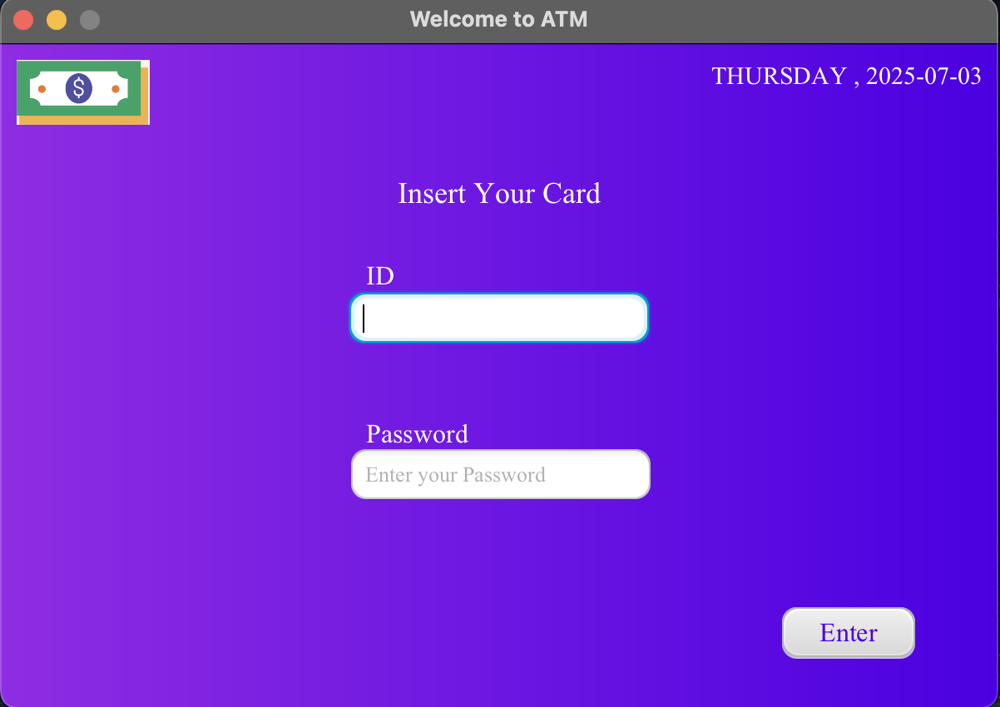
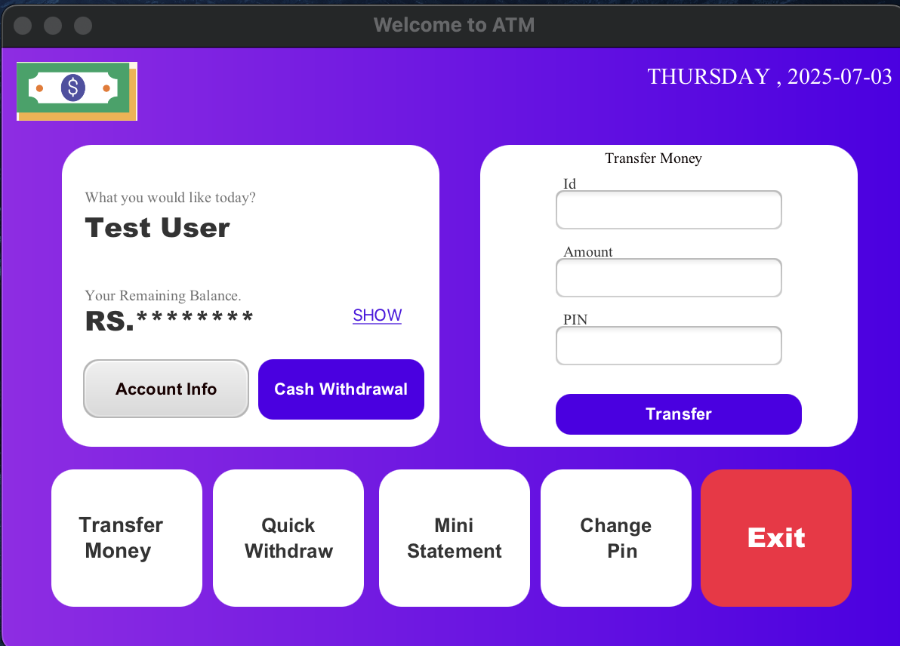
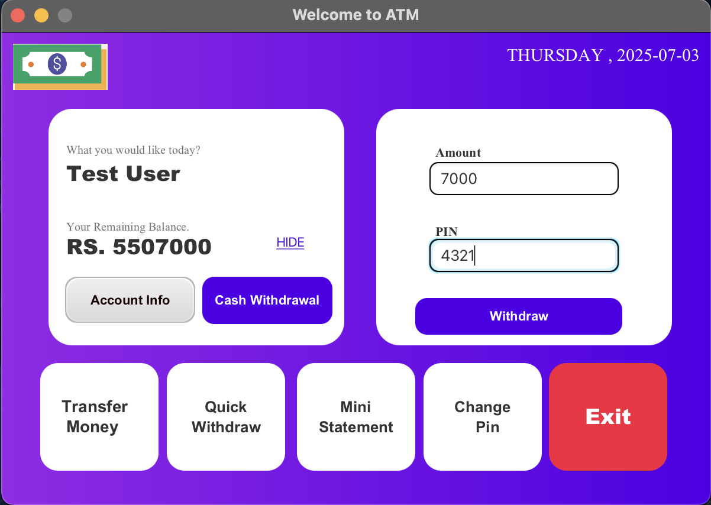
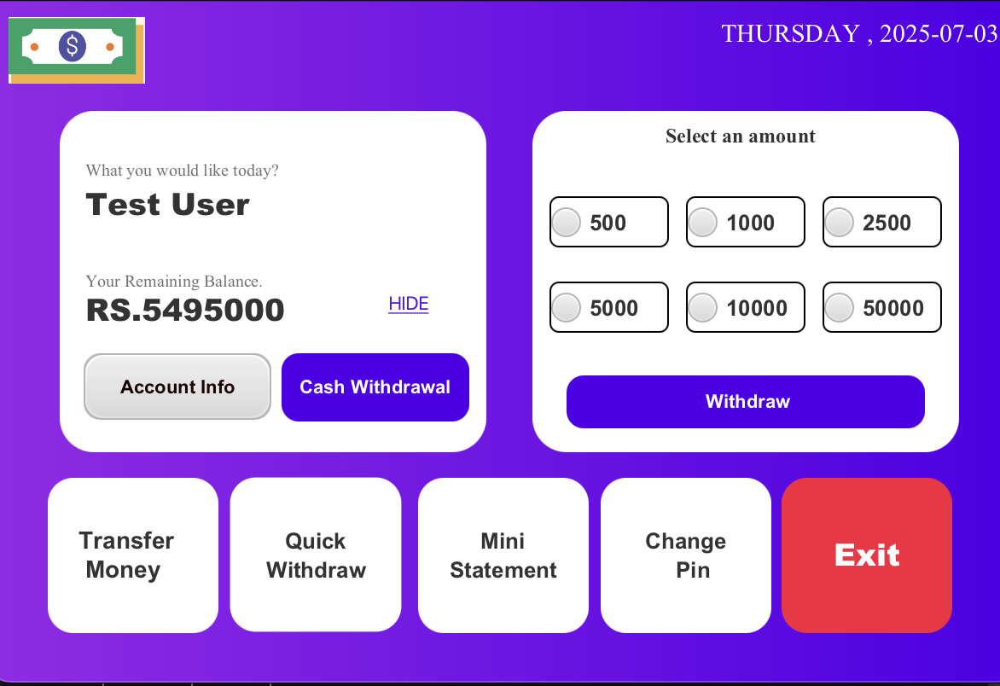
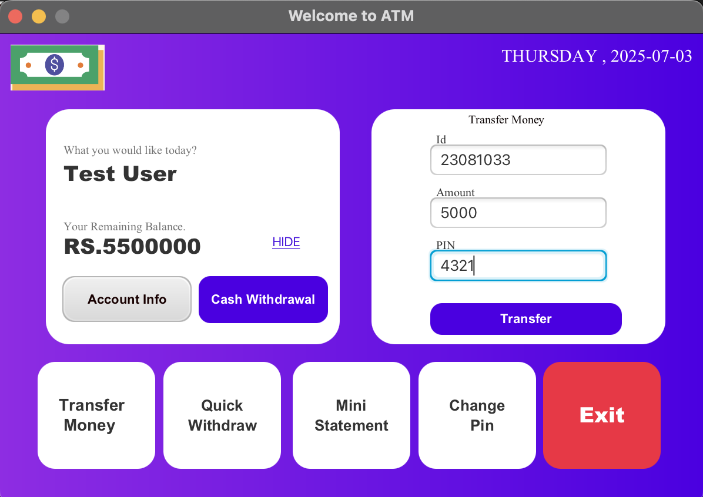
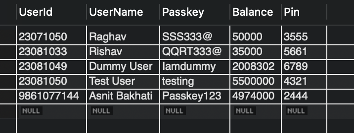
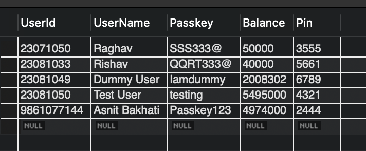
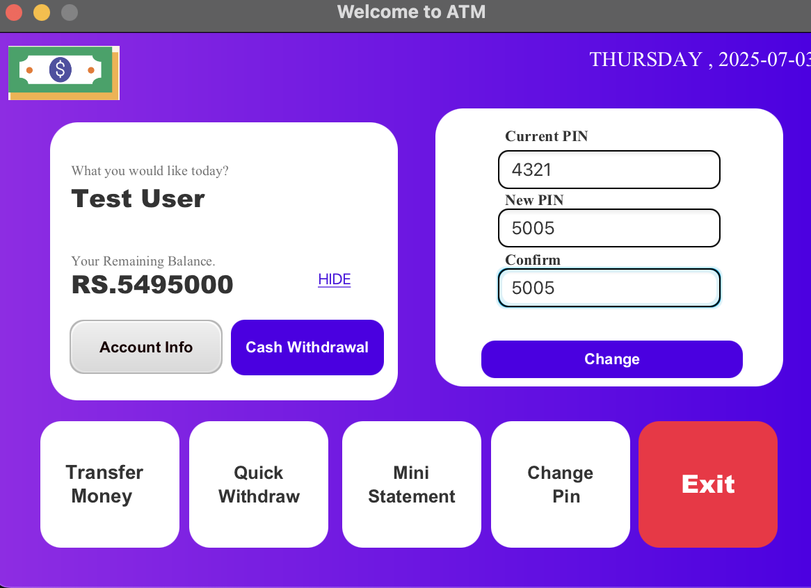
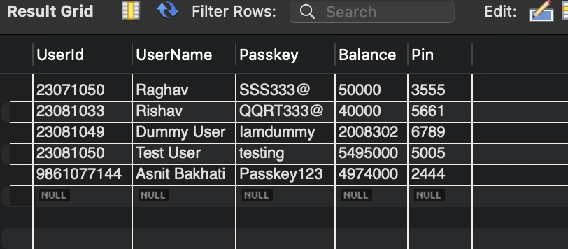
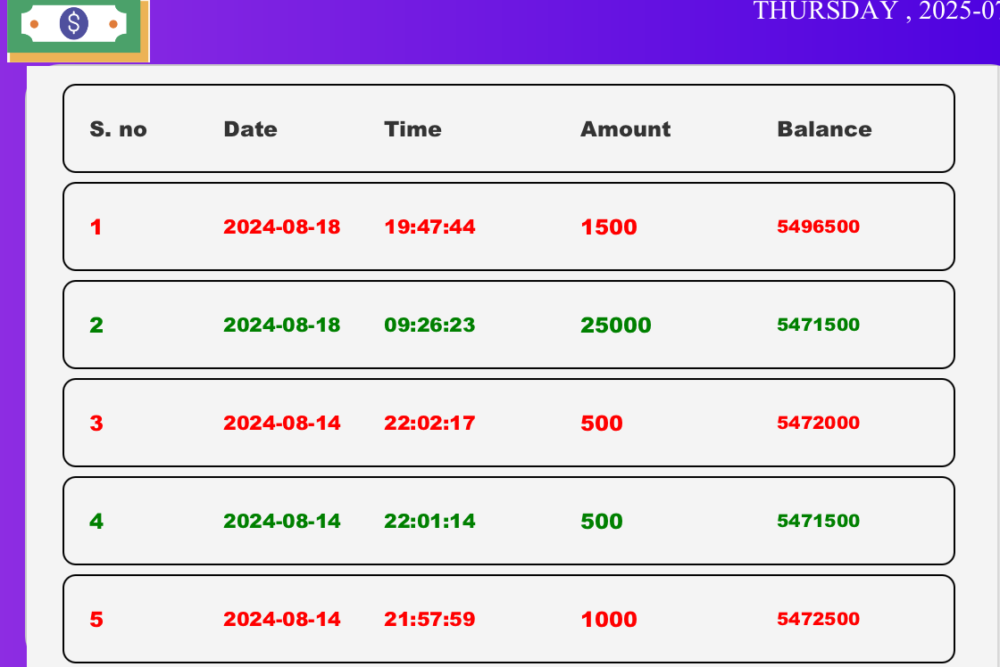

# ATMFx

ATMFx is a desktop-based ATM simulator application built using **JavaFX** and **JDBC**, featuring a modern UI design. It was developed to demonstrate the integration of Java with SQL databases while simulating core banking functions in an ATM interface.

> **Note:** This was one of my first projects using Java and SQL. While functional, it contains architectural limitations and known vulnerabilities.

## Features

- Transfer Money
- Generate Mini Statement
- Change PIN
- View Balance
- Custom Withdrawal

## SQL Implementation

For building the database layer of the application, I utilized a variety of **SQL techniques** including **stored procedures**, **triggers**, and **joins** (both self joins and table joins). These SQL features were crucial in handling core functionalities such as balance updates, transaction history retrieval, and user authentication. The integration of these advanced SQL concepts helped streamline the operations and make the application more dynamic and responsive.

## Architecture

The application follows a **monolithic architecture**, where both the **database layer** and **application logic** are tightly coupled. This approach simplifies development but introduces challenges in scalability and security.

## Tech Stack

- **Java**
- **JavaFX**
- **JDBC**
- **SQL (MySQL or any JDBC-compatible DB)**

## How to Run

1. Clone the repository:
   ```bash
   git clone https://github.com/CodeAvecAsnit/ATMfx.git
2.  Open the project in your Java IDE.
3.  Run the `ATM.java` file.


## Screenshots

### Login Page

*After logging in with valid credentials, the application navigates to the landing page.*

---

### Landing Page

*The landing page serves as the main dashboard, allowing users to access different ATM features. The account balance is initially hidden for privacy.*

---

### Amount Withdrawal

*Users can withdraw any valid amount from their account. The updated balance is reflected in the database in real time.*

---

### Quick Withdrawal

*This feature allows users to withdraw predefined amounts instantly. The options are displayed in the user interface for quick access.*

---

### Transfer Money

*This feature enables users to transfer a custom amount to another user. In this example, User ID 23081050 transfers ₹5000 to User ID 23081033. This operation is handled through database triggers, ensuring seamless updates.*

#### Before Transfer

*Before the transfer: TestUser has Rs5,50,000, and Rishav has Rs35,000.*

#### After Transfer

*After the transfer: The updated balances reflect the ₹5000 transfer, automatically processed by the trigger — without requiring complex backend logic.*

---

### Change PIN

*Users can securely change their PIN. A key feature for account safety and access control.*


*The database reflects the updated PIN. In this example, TestUser's PIN has changed from 4321 to 5005.*

---

### Mini Statement

*This was the most technically challenging part of the application. The dynamically generated statement is displayed in a scrollable pane, which required precise control of label coordinates and layout logic. It was a rewarding challenge as a beginner working with JavaFX.*
